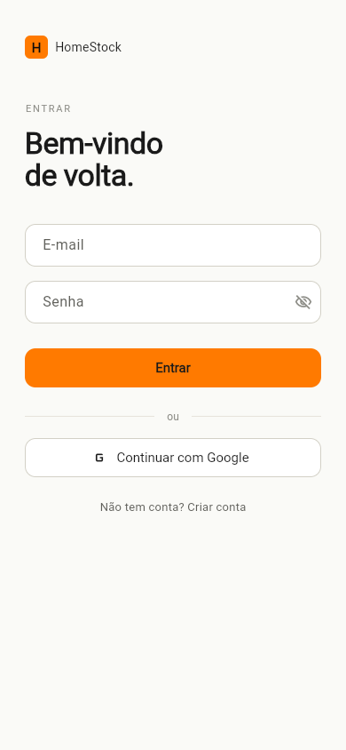
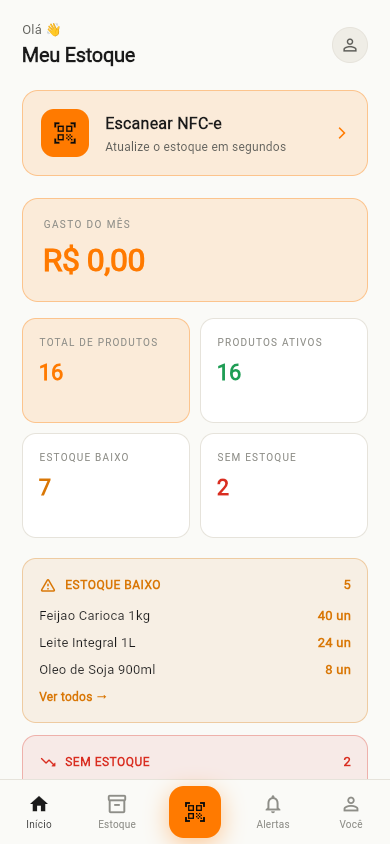
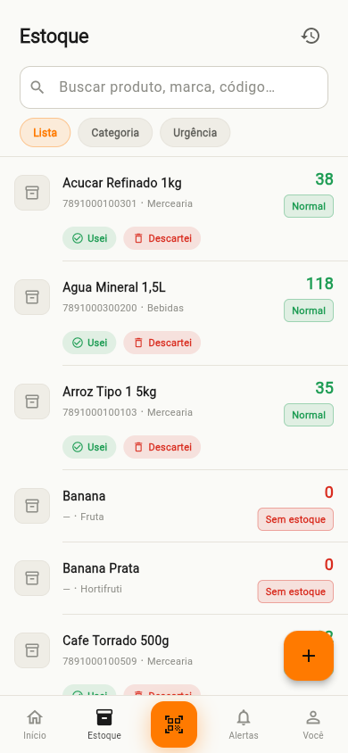
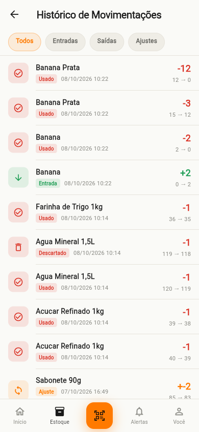
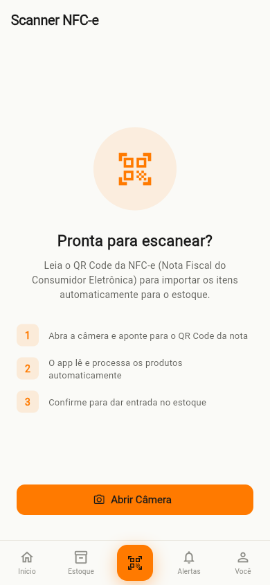
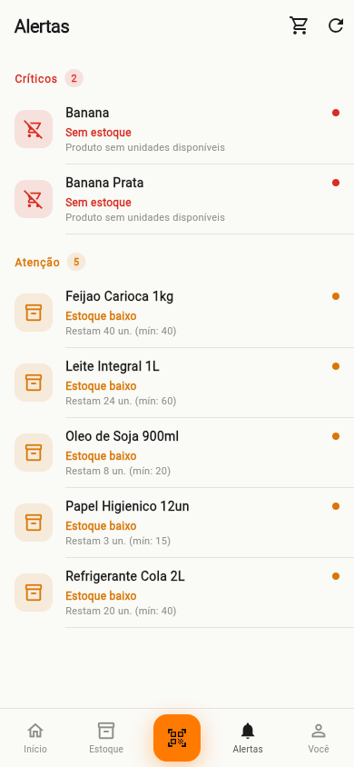

# HomeStock Mobile

Aplicativo mobile em Flutter para controle de estoque doméstico. Os produtos são dados de cupons fiscais: o usuário lê o QR Code da NFC-e (Nota Fiscal de Consumidor Eletrônica) com a câmera e o app registra os itens no estoque.

## Capturas de tela

<p align="center">
  
  
  
  
  
  
  
</p>

## Funcionalidades

- **Autenticação**: tela de onboarding e login. A sessão é mantida com token de acesso armazenado de forma segura.
- **Início (dashboard)**: resumo do estoque com indicadores e cards de validade.
- **Estoque**: listagem de produtos com status (em estoque, estoque baixo, sem estoque), cadastro e edição de produtos.
- **Movimentações**:
  - registrar entrada de produtos;
  - registrar saída de produtos;
  - histórico de movimentações, com filtros por tipo e por produto.
- **Scanner de NFC-e**: leitura do QR Code da nota fiscal pela câmera, envio da URL ao backend e exibição do resultado em um painel inferior.
- **Alertas**: lista de produtos sem estoque (crítico) e com estoque abaixo do mínimo (aviso). Os alertas são calculados no próprio app a partir dos dados de estoque.

## Tecnologias

| Área | Pacote |
|---|---|
| Framework | Flutter (SDK `>=3.3.0 <4.0.0`) |
| Gerência de estado e injeção de dependência | `flutter_riverpod` |
| Navegação | `go_router` |
| Cliente HTTP | `dio` |
| Armazenamento seguro do token | `flutter_secure_storage` |
| Leitura de QR Code | `mobile_scanner` |
| Formatação e localização | `intl`, `flutter_localizations` (pt-BR) |

A arquitetura segue **Clean Architecture por feature**, com as camadas `data`, `domain` e `presentation`:

```
lib/
├── core/            # rede (Dio), roteamento, tema, armazenamento, erros
├── features/
│   ├── auth/
│   ├── dashboard/
│   ├── stock/
│   ├── movements/
│   ├── scanner/
│   └── alerts/
├── shared/          # widgets e extensões reutilizados
└── main.dart
```

Cada feature contém:

- `data/`: datasources remotos, models e implementações de repositório;
- `domain/`: entities, contratos de repositório e use cases;
- `presentation/`: páginas, widgets e providers do Riverpod.

## Pré-requisitos

- Flutter SDK instalado e configurado (`flutter doctor` sem erros para a plataforma alvo);
- Android Studio com um emulador Android, ou um dispositivo físico com depuração USB;
- O backend da API em execução (veja a seção abaixo).

## Como executar

1. Clone o repositório e entre na pasta do projeto:

   ```bash
   git clone <url-do-repositorio>
   cd HomeStockMobile
   ```

2. Instale as dependências:

   ```bash
   flutter pub get
   ```

3. Confirme que o backend está rodando em `http://localhost:8080`.

4. Se as pastas de plataforma (`android/`, `web/`) não existirem no seu clone, gere-as uma vez:

   ```bash
   flutter create --platforms=web,android .
   ```

5. Execute o app. Para rodar no navegador, sem emulador:

   ```bash
   flutter run -d chrome
   ```

   Para Android, use um emulador ou dispositivo físico com `flutter run`.

### Configuração da URL da API

A URL base fica em `lib/core/network/dio_client.dart`. Ela muda conforme a plataforma:

```dart
final _kBaseUrl = kIsWeb
    ? 'http://localhost:8080/api/v1'
    : 'http://10.0.2.2:8080/api/v1';
```

- **Emulador Android**: `10.0.2.2` aponta para o `localhost` da máquina host. Use o valor como está.
- **Dispositivo físico**: troque pelo IP da máquina na rede local, por exemplo `http://192.168.0.10:8080/api/v1`. O celular e o computador precisam estar na mesma rede.

Na versão web, o backend precisa liberar CORS para a origem do Flutter (por exemplo, `http://localhost:5000`, porta usada por `flutter run -d chrome --web-port 5000`).

Para ambientes diferentes, a recomendação é trocar essa constante por uma variável de ambiente ou por flavors do Flutter.

## Backend

Este repositório contém somente o aplicativo mobile. A API REST roda em um projeto separado e precisa estar disponível em `/api/v1`. Os principais endpoints usados pelo app são:

| Método | Endpoint | Uso |
|---|---|---|
| `POST` | `/auth/login` | Login |
| `POST` | `/auth/logout` | Logout |
| `GET` | `/dashboard` | Dados da tela inicial |
| `GET` | `/products` | Listagem de produtos (com filtros) |
| `GET` | `/products/{id}` | Detalhe de produto |
| `POST` | `/products` | Cadastro de produto |
| `PUT` | `/products/{id}` | Edição de produto |
| `DELETE` | `/products/{id}` | Remoção de produto |
| `POST` | `/stock-movements/adjust` | Registro de entrada, saída ou ajuste (`type`: `ENTRY`, `EXIT`, `ADJUSTMENT`, `RETURN`) |
| `GET` | `/stock-movements` | Histórico de movimentações (filtros de data e tipo são feitos no app) |
| `GET` | `/stock-movements/product/{productId}` | Movimentações por produto |
| `POST` | `/nfce/process` | Leitura do QR Code da NFC-e (`qrCode`); a nota fica pendente |
| `POST` | `/nfce/{invoiceId}/confirm` | Dar entrada: confirma a nota e atualiza o estoque |
| `POST` | `/nfce/{invoiceId}/reject` | Rejeita a nota pendente |

Todas as requisições, exceto o login, enviam o cabeçalho `Authorization: Bearer <token>`, adicionado automaticamente pelo `AuthInterceptor`. Erros HTTP são convertidos em `Failure` (sem conexão, não autorizado, não encontrado ou erro do servidor), e a mensagem da API é exibida ao usuário quando existe.

## Rotas

| Caminho | Tela |
|---|---|
| `/onboarding` | Apresentação inicial (pública) |
| `/login` | Login (pública) |
| `/home` | Início |
| `/stock` | Estoque |
| `/stock/new` | Novo produto |
| `/stock/:id/edit` | Editar produto |
| `/stock/entry` | Entrada de estoque |
| `/stock/exit` | Saída de estoque |
| `/stock/history` | Histórico de movimentações |
| `/scan` | Tela inicial do scanner |
| `/scan/camera` | Câmera em tela cheia (`?tutorial=true` mostra o tutorial) |
| `/alerts` | Alertas |

Usuários não autenticados são redirecionados para `/login`. Usuários autenticados que acessam telas públicas vão para `/home`.

## Estrutura da navegação

A barra inferior tem quatro áreas: **Início**, **Estoque**, **Alertas** e um botão central de **scanner**, que abre a câmera em tela cheia. A aba **Você** é um espaço reservado e está fora do escopo atual.

## Testes e análise estática

```bash
flutter analyze
flutter test
```

As regras de lint estão em `analysis_options.yaml`, com base em `flutter_lints`.

## Status do projeto

Versão `1.0.0+1`, em desenvolvimento. O projeto foi migrado de uma versão web em React, e alguns comentários no código ainda referenciam os arquivos originais.
